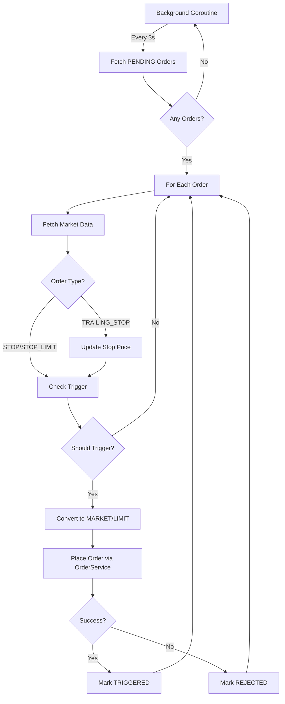

# US-4.1.4 Phase 2: Stop Order Trigger Monitoring - Implementation Walkthrough

**Status:** ✅ **Backend Complete** | ⏸️ Frontend Deferred  
**Date:** 2026-01-06

---

## 🎯 What Was Built

Phase 2 implements the **background monitoring service** that automatically detects when stop orders should trigger and converts them to executable MARKET or LIMIT orders.

### Key Features Implemented

1. ✅ **Background Monitoring Service** - Polls every 3 seconds
2. ✅ **Trigger Detection** - Checks STOP, STOP_LIMIT, and TRAILING_STOP conditions
3. ✅ **Trailing Stop Updates** - Automatically adjusts stop price as market moves
4. ✅ **Order Conversion** - Converts PENDING → TRIGGERED → NEW (market/limit)
5. ✅ **Balance Validation** - Re-checks balance at trigger time
6. ✅ **API Endpoint** - `GET /api/orders/pending-stops`

---

## 📁 Files Changed

### Backend

#### [NEW] [stop_order_service.go](file:///c:/Users/asus/Downloads/Aequitas/Aequitas/backend/internal/services/stop_order_service.go)

**Purpose:** Core service for stop order trigger monitoring and execution

**Key Methods:**

| Method | Purpose |
|--------|---------|
| `Start()` | Starts background goroutine with 3s ticker |
| `Stop()` | Gracefully shuts down monitoring |
| `MonitorStopOrders()` | Main loop - fetches PENDING orders and checks triggers |
| `CheckTriggerConditions()` | Determines if order should trigger based on current price |
| `UpdateTrailingStop()` | Adjusts trailing stop price as market moves favorably |
| `TriggerStopOrder()` | Converts PENDING order to MARKET/LIMIT and places it |

**Trigger Logic:**

```go
// STOP Orders
if order.Side == "BUY" {
    return currentPrice >= *order.StopPrice  // Trigger when price rises
} else {
    return currentPrice <= *order.StopPrice  // Trigger when price falls
}

// TRAILING_STOP Orders
// For SELL: Stop price trails below highest price reached
// For BUY: Stop price trails above lowest price reached
// Triggers when price reverses and hits current stop price
```

**Error Handling:**
- Market data unavailable → Skip cycle, log warning, continue
- Insufficient balance at trigger → Mark order REJECTED
- Database errors → Log and continue to next order

---

#### [MODIFY] [order_repository.go](file:///c:/Users/asus/Downloads/Aequitas/Aequitas/backend/internal/repositories/order_repository.go)

**Added Method:**

```go
func (r *OrderRepository) FindPendingStopOrders() ([]*models.Order, error)
```

**Purpose:** Efficiently query all orders with `status = "PENDING"` for monitoring

**Query:** `db.orders.find({ status: "PENDING" })`

---

#### [MODIFY] [main.go](file:///c:/Users/asus/Downloads/Aequitas/Aequitas/backend/cmd/server/main.go)

**Changes:**

1. **Initialize StopOrderService** (after line 99):
   ```go
   stopOrderService := services.NewStopOrderService(orderRepo, marketDataRepo, orderService)
   stopOrderService.Start()
   defer stopOrderService.Stop()
   ```

2. **Add Route** (line 173):
   ```go
   protected.HandleFunc("/orders/pending-stops", orderController.GetPendingStops).Methods("GET", "OPTIONS")
   ```

**Pattern:** Follows same initialization as `PricingService` and `CandleCleanupService`

---

#### [MODIFY] [order_controller.go](file:///c:/Users/asus/Downloads/Aequitas/Aequitas/backend/internal/controllers/order_controller.go)

**Added Handler:**

```go
func (c *OrderController) GetPendingStops(w http.ResponseWriter, r *http.Request)
```

**Endpoint:** `GET /api/orders/pending-stops`

**Response:**
```json
{
  "success": true,
  "message": "Pending stop orders fetched successfully",
  "data": {
    "orders": [...],
    "total": 5
  }
}
```

---

#### [MODIFY] [order_service.go](file:///c:/Users/asus/Downloads/Aequitas/Aequitas/backend/internal/services/order_service.go)

**Updated:** `CancelOrder()` method

**Change:** Allow cancelling both `NEW` and `PENDING` orders

```go
// Before: if order.Status != "NEW"
// After:  if order.Status != "NEW" && order.Status != "PENDING"
```

**Reason:** Users should be able to cancel stop orders before they trigger

---

## 🔄 How It Works

### Monitoring Flow



### Trigger Examples

#### Example 1: SELL STOP Order

```
Current Price: ₹2,500
User places SELL STOP at ₹2,490

Monitoring Loop:
  Cycle 1: LTP = ₹2,502 → No trigger (above stop)
  Cycle 2: LTP = ₹2,495 → No trigger (above stop)
  Cycle 3: LTP = ₹2,488 → TRIGGER! (below stop)
  
Action: Create MARKET SELL order for same quantity
Result: Order status: PENDING → TRIGGERED → NEW (market order)
```

#### Example 2: TRAILING_STOP (SELL, 2%)

```
Current Price: ₹2,500
User places SELL TRAILING_STOP with 2% trail

Initial State:
  currentStopPrice = ₹2,450 (2% below ₹2,500)
  highestPrice = ₹2,500

Monitoring Loop:
  Cycle 1: LTP = ₹2,550 → Update stop to ₹2,499 (2% below ₹2,550)
  Cycle 2: LTP = ₹2,560 → Update stop to ₹2,508.80 (2% below ₹2,560)
  Cycle 3: LTP = ₹2,500 → TRIGGER! (fell below ₹2,508.80)
  
Action: Create MARKET SELL order
Result: Locked in profit from ₹2,500 → ₹2,560 move
```

---

## 🧪 Manual Testing Guide

### Prerequisites

1. Backend running: `cd backend && go run cmd/server/main.go`
2. Frontend running: `cd frontend && npm run dev`
3. User logged in with funded account

---

### Test 1: SELL STOP Order Trigger

**Objective:** Verify SELL STOP triggers when price falls

**Steps:**
1. Navigate to any instrument (e.g., RELIANCE)
2. Note current LTP (e.g., ₹2,500)
3. Enable "Advanced" mode in TradePanel
4. Place SELL STOP order:
   - Side: SELL
   - Order Type: STOP
   - Quantity: 1
   - Stop Price: ₹2,490 (below current)
5. Submit order
6. Check backend logs for: `"🔍 Monitoring X pending stop orders"`
7. Wait for price to fall below ₹2,490 (pricing engine updates every 3s)
8. Watch logs for: `"🎯 Stop order triggered: ..."`

**Expected Results:**
- ✅ Order created with status `PENDING`
- ✅ Monitoring logs show order being checked
- ✅ When LTP <= ₹2,490: Order triggers
- ✅ New MARKET SELL order created
- ✅ Original order status: `TRIGGERED`
- ✅ `triggeredAt` and `triggerPrice` fields populated

**Check Database:**
```javascript
db.orders.find({ status: "TRIGGERED" }).pretty()
// Should show triggeredAt, triggerPrice, and parentOrderId
```

---

### Test 2: BUY STOP Order Trigger

**Objective:** Verify BUY STOP triggers when price rises

**Steps:**
1. Note current LTP (e.g., ₹2,500)
2. Place BUY STOP order:
   - Stop Price: ₹2,510 (above current)
   - Quantity: 1
3. Wait for price to rise above ₹2,510

**Expected Results:**
- ✅ Triggers when LTP >= ₹2,510
- ✅ Creates MARKET BUY order
- ✅ Balance validated at trigger time

---

### Test 3: TRAILING_STOP Price Updates

**Objective:** Verify trailing stop adjusts as market moves

**Steps:**
1. Note current LTP (e.g., ₹2,500)
2. Place SELL TRAILING_STOP:
   - Trail Type: PERCENTAGE
   - Trail Amount: 2%
3. Check database immediately:
   ```javascript
   db.orders.findOne({ orderType: "TRAILING_STOP", status: "PENDING" })
   // currentStopPrice should be ₹2,450 (2% below ₹2,500)
   // highestPrice should be ₹2,500
   ```
4. Wait for price to rise (e.g., to ₹2,550)
5. Check logs for: `"📈 Trailing stop updated: ..."`
6. Check database again:
   ```javascript
   // currentStopPrice should now be ₹2,499 (2% below ₹2,550)
   // highestPrice should be ₹2,550
   ```
7. Wait for price to fall below new stop price

**Expected Results:**
- ✅ Stop price increases as market rises
- ✅ Stop price NEVER decreases
- ✅ Order triggers when price reverses

---

### Test 4: STOP_LIMIT Conversion

**Objective:** Verify STOP_LIMIT creates LIMIT order (not MARKET)

**Steps:**
1. Place SELL STOP_LIMIT:
   - Stop Price: ₹2,490
   - Limit Price: ₹2,485
2. Wait for trigger

**Expected Results:**
- ✅ Triggers when LTP <= ₹2,490
- ✅ Creates LIMIT order with price = ₹2,485
- ✅ Order type is `LIMIT` (not `MARKET`)

---

### Test 5: Insufficient Balance at Trigger

**Objective:** Verify rejection if balance insufficient when triggered

**Steps:**
1. Fund account with ₹10,000
2. Place BUY STOP:
   - Stop Price: ₹2,510
   - Quantity: 100 (requires ~₹251,000)
3. Wait for trigger

**Expected Results:**
- ✅ Order triggers but fails balance check
- ✅ Status: PENDING → TRIGGERED → REJECTED
- ✅ Logs show: "❌ Stop order trigger failed: ... insufficient balance"

---

### Test 6: Cancel PENDING Order

**Objective:** Verify user can cancel before trigger

**Steps:**
1. Place any STOP order
2. Before it triggers, call: `DELETE /api/orders/{id}`
3. Check status

**Expected Results:**
- ✅ Status changes to `CANCELLED`
- ✅ Order never triggers even if price reaches stop level
- ✅ Monitoring service ignores cancelled orders

---

### Test 7: Multiple Orders on Same Instrument

**Objective:** Verify independent trigger handling

**Steps:**
1. Place 3 STOP orders on same instrument:
   - SELL STOP at ₹2,490
   - SELL STOP at ₹2,480
   - BUY STOP at ₹2,520
2. Watch price movements

**Expected Results:**
- ✅ Each order triggers independently
- ✅ All three can be PENDING simultaneously
- ✅ Triggers happen in correct order based on price

---

## 📊 Verification Checklist

- [x] Backend compiles without errors
- [ ] SELL STOP triggers when price falls
- [ ] BUY STOP triggers when price rises
- [ ] TRAILING_STOP price updates correctly
- [ ] STOP_LIMIT creates LIMIT order
- [ ] Insufficient balance handled gracefully
- [ ] PENDING orders can be cancelled
- [ ] Multiple orders work independently
- [ ] Logs show clear trigger events
- [ ] Database fields populated correctly

---

## 🚀 Next Steps

### Immediate (Testing Phase)
1. Run manual tests 1-7
2. Verify all expected behaviors
3. Check database for correct field population
4. Review logs for any errors

### Future Enhancements (Phase 3+)
- Frontend UI for viewing PENDING orders
- Real-time WebSocket updates for trailing stops
- Email/SMS notifications on trigger
- Trigger history API endpoint
- Performance optimization for 1000+ orders

---

## 🎓 Key Learnings

1. **Background Service Pattern**: Followed same pattern as `PricingService` for consistency
2. **Error Resilience**: Service continues even if individual orders fail
3. **Balance Re-validation**: Critical to check balance at trigger time, not just placement
4. **Trailing Stop Logic**: Stop price only moves favorably, never reverses
5. **Order Lifecycle**: PENDING → TRIGGERED → NEW (market/limit) or REJECTED

---

## 📝 Notes

- **No Frontend Changes**: Phase 2 focused on backend only
- **Database Indexes**: Deferred to Phase 3 for performance optimization
- **Trigger History**: API endpoint deferred to Phase 3
- **Testing**: All verification is manual (no automated tests)
